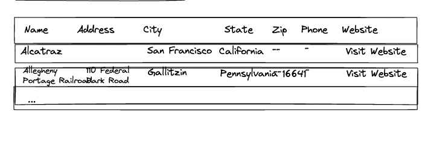
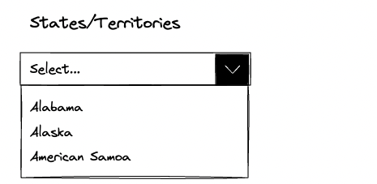
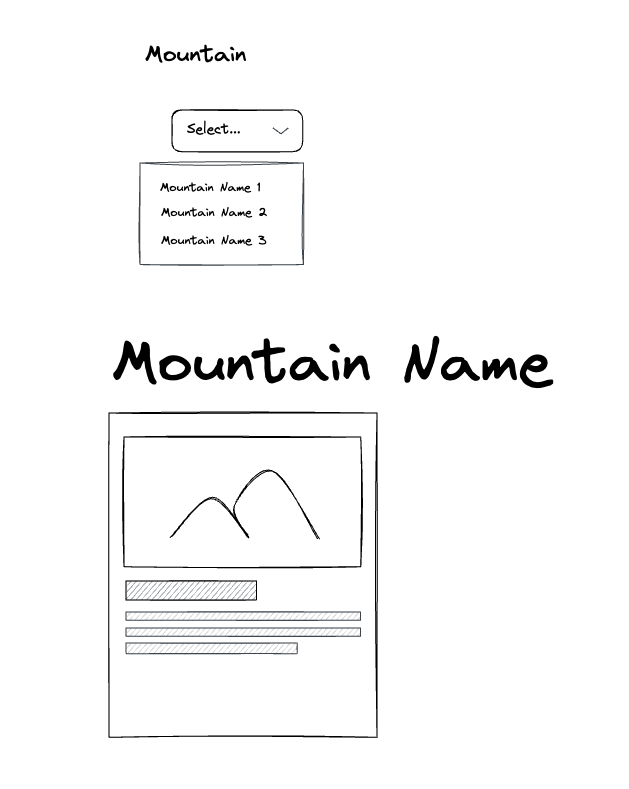
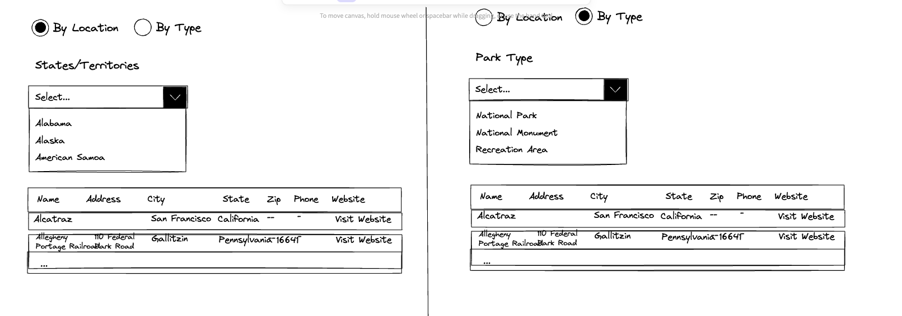

# Capstone Tips

## Video Walkthrough

- [Capstone 2: Enjoy the Outdoors Video Walkthrough](https://youtu.be/g7GforwZfKU)

<iframe width="560" height="315" src="https://www.youtube.com/embed/g7GforwZfKU?si=lTpkAUZhmbnFy-MM" title="YouTube video player" frameborder="0" allow="accelerometer; autoplay; clipboard-write; encrypted-media; gyroscope; picture-in-picture; web-share" referrerpolicy="strict-origin-when-cross-origin" allowfullscreen></iframe>

## Starter Project

If you haven't already, use these [directions to setup the starter project](./starter-project-setup.md).

## Parks Page Part 1

`national-parks.html`

1. Load `parksArray` into a parks table.

   - Use the the javascript code from the [spongebob-site](../demos/spongebob-site/scripts/main.js) as an example of how to load an array of objects into a table.

     

     > As a stretch goal (optional/not required) you could also load the data into cards and allow the user to change between the table and card view

1. Load the `locationsArray` into a select list (dropdown) with Label of **States**.

   - Use [the friend group dropdown code](../demos/spongebob-site/scripts/main.js#L122) as an example of how to load a dropdown list.

     

1. When the selected item in the states list changes filter the parks table by the selected state.

   - Use [filterByFriendGroup function](../demos/spongebob-site/scripts/main.js#L160) as an example. The friendGroups in the example are like the locations on the `national-parks.html` page.

## Mountains Page

1. Complete the mountains page.
   

- Use [Football Teams Dropdown/Detail as an example](https://github.com/craigmckeachie/fall2024-workbook4/blob/main/exercises/football/index.html)

## Parks Page Part 2

1. Load the `parkTypesArray` into a select list (dropdown) with Label of **Park Types**.

   - Use the code you wrote to load the states into a dropdown in Part 1 as an example.

2. When the selected item in the park types list changes filter the parks table by the selected park type.

   - Use the function you wrote to filterByState as an example. You should be able to copy it and change a few things for it to work

## Parks Page Part 3

- Add radio buttons in a group for the search type (By Location or By Type). Hide and show the appropriate `select list\dropdown` when the page loads and when the search type selected changes.

  - Use the [Hide/Show Radio Demo](../demos/hide-show-radio.html) as an example.

- Below is a mockup for the completed parks page

  

  > Note the left side and right side of this image are each the entire page. They simply show the page in two different states: when the location dropdown is displayed and when the park type dropdown is displayed

## Other

- Be sure you have consistent navigation between all your pages
